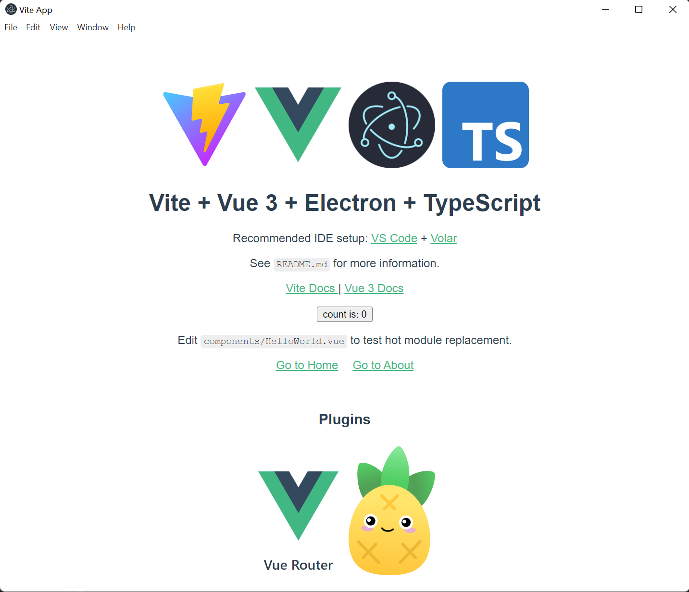

# Vite+Vue3+Electron+Typescript template



## Get Started

### 1. clone this repository

```bash
git clone https://github.com/Yukun-Guo/vite-vue3-electron-ts-template.git
```

### 2. install packages

```bash
npm i
```

### 3. run

```bash
npm run app:dev
```

## How to create this template?

### 1. [create Vite project](https://vitejs.dev/guide/#trying-vite-online)

```bash
npm create vite@latest
```

### 2. Install [electron](https://www.electronjs.org/docs/latest/tutorial/quick-start) and [concurrently](https://www.npmjs.com/package/concurrently)

```bash
npm install --save-dev electron@latest electron-builder concurrently
```

### 3. setup electron

#### Create file `src/electron/main/main.ts` and `src/electron/preload/preload.ts`

```ts {main.ts}
// src/electron/main/main.ts
import { join } from 'path';
import {
    app,
    BrowserWindow
} from 'electron';

const isDev = process.env.npm_lifecycle_event === "app:dev" ? true : false;

function createWindow() {
    // Create the browser window.
    const mainWindow = new BrowserWindow({
        width: 800,
        height: 600,
        webPreferences: {
            preload: join(__dirname, '../preload/preload.js'),
        },
    });

    // and load the index.html of the app.
    if (isDev) {
        mainWindow.loadURL('http://localhost:3000');
        mainWindow.webContents.openDevTools();// Open the DevTools.
    } else {
        mainWindow.loadFile(join(__dirname, '../../index.html'));
    }
    // mainWindow.loadURL( //this doesn't work on macOS in build and preview mode
    //     isDev ?
    //     'http://localhost:3000' :
    //     join(__dirname, '../../index.html')
    // );
}

// This method will be called when Electron has finished
// initialization and is ready to create browser windows.
// Some APIs can only be used after this event occurs.
app.whenReady().then(() => {
    createWindow()
    app.on('activate', function () {
        // On macOS it's common to re-create a window in the app when the
        // dock icon is clicked and there are no other windows open.
        if (BrowserWindow.getAllWindows().length === 0) createWindow()
    })
});

// Quit when all windows are closed, except on macOS. There, it's common
// for applications and their menu bar to stay active until the user quits
// explicitly with Cmd + Q.
app.on('window-all-closed', () => {
    if (process.platform !== 'darwin') {
        app.quit();
    }
});
```

```js {preload.ts}
// src/electron/preload/preload.ts
// All of the Node.js APIs are available in the preload process.
// It has the same sandbox as a Chrome extension.
window.addEventListener('DOMContentLoaded', () => {
    const replaceText = (selector:any, text:any) => {
      const element = document.getElementById(selector)
      if (element) element.innerText = text
    }

    for (const dependency of ['chrome', 'node', 'electron']) {
      replaceText(`${dependency}-version`, process.versions[dependency])
    }
  })
```

### 4. Edit `tsconfig.json`

```ts
{
  "compilerOptions": {
    "target": "esnext",
    "useDefineForClassFields": true,
    "module": "commonjs",
    "moduleResolution": "node",
    "strict": true,
    "jsx": "preserve",
    "sourceMap": true,
    "resolveJsonModule": true,
    "isolatedModules": false,
    "esModuleInterop": true,
    "lib": ["esnext", "dom"],
    "skipLibCheck": true,
    "outDir": "dist/electron"
  },
  "include": ["src/electron/**/*"],
  "references": [{
    "path": "./tsconfig.node.json"
  }]
}
```

### 5. Edit `vite.config.ts`
  
  ```ts {vite.config.ts}
  import { defineConfig } from 'vite'
  import vue from '@vitejs/plugin-vue'
  // https://vitejs.dev/config/
  export default defineConfig({
    plugins: [vue()],
    base: './' //add base path
  })
  ```

### 6. Edit `package.json`

``` json
{
  "name": "vite-vue3-electron-ts-template",
  "private": true,
  "version": "0.0.0",
  "author": "Your Name",
  "main": "dist/electron/main/main.js",
  "scripts": {
    "vite:dev": "vite",
    "vite:build": "vue-tsc --noEmit && vite build",
    "vite:preview": "vite preview",
    "ts": "tsc",
    "watch": "tsc -w",
    "lint": "eslint -c .eslintrc --ext .ts ./src",
    "app:dev": "tsc && concurrently vite \" electron .\" \"tsc -w\"",
    "app:build": "npm run vite:build && tsc && electron-builder",
    "app:preview": "npm run vite:build && tsc && electron ."
  },
  "build": {
    "appId": "YourAppID",
    "asar": true,
    "directories": {
      "buildResources": "assets",
      "output": "release/${version}"
    },
    "files": [
      "dist"
    ],
    "mac": {
      "artifactName": "${productName}_${version}.${ext}",
      "target": [
        "dmg"
      ]
    },
    "win": {
      "target": [{
        "target": "nsis",
        "arch": [
          "x64"
        ]
      }],
      "artifactName": "${productName}_${version}.${ext}"
    },
    "nsis": {
      "oneClick": false,
      "perMachine": false,
      "allowToChangeInstallationDirectory": true,
      "deleteAppDataOnUninstall": false
    }
  },
  "dependencies": {
    "vue": "^3.2.25"
  },
  "devDependencies": {
    "@vitejs/plugin-vue": "^2.3.3",
    "concurrently": "^7.2.2",
    "electron": "^19.0.6",
    "electron-builder": "^23.1.0",
    "typescript": "^4.5.4",
    "vite": "^2.9.9",
    "vue-tsc": "^0.34.7"
  }
}
```

## 7. Setup Main Process debug configuration: create `launch.json` to `.vscode` folder

``` json
{
    "version": "0.2.0",
    "configurations": [{
        "name": "Debug Main Process",
        "type": "node",
        "request": "launch",
        "cwd": "${workspaceFolder}",
        "runtimeExecutable": "${workspaceFolder}/node_modules/.bin/electron",
        "windows": {
            "runtimeExecutable": "${workspaceFolder}/node_modules/.bin/electron.cmd"
        },
        "args": ["."],
        "outputCapture": "std"
    }]
}
```

## 8. Run

### dev mode

```bash
npm run app:dev  
```

### preview mode

```bash
npm run app:preview  
```

### build app

```bash
npm run app:build
```

### debug main process

1. Add a break point in the main process `src/electron/main/main.ts`.
2. Open the `Run and Debug (Ctrl+Shift+D)` tool, and select `Debug Main Process`.
*Note: Before using the debug tool to debug the main process, you should run the preview script `npm run app:preview` first to build the Vue app.*

## Update

### 2022/08/16: add `pinia`:pineapple: and `vue-router`